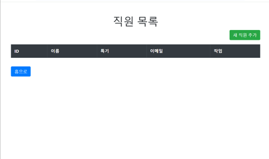
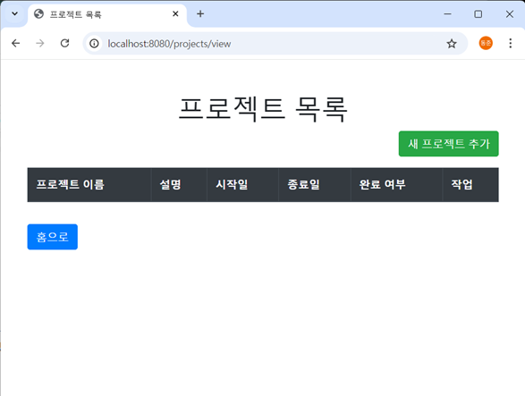
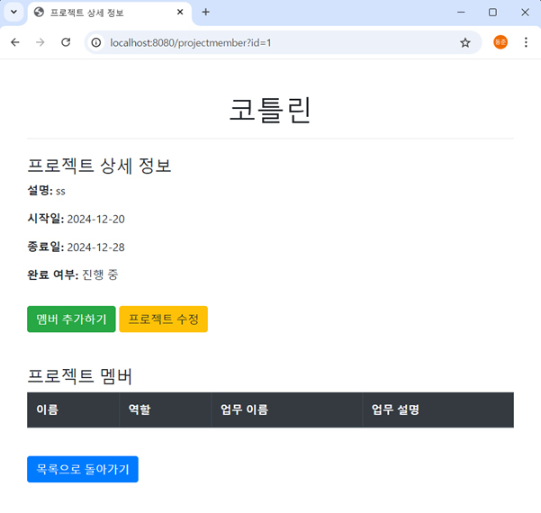

# 코틀린 프로그래밍과 응용  
### 설계프로젝트 과제제안서  

- **과목명:** 코틀린 프로그래밍과 응용  
- **제출일자:** 2024년 12월 24일  
- **성명/학번:** 김동하 (22012231)  
- **소속 학과:** 디지털융합대학 컴퓨터학부, 정보통신공학전공  

---

## 과제 제안서  

### 과제명  
**Kotlin/JS 및 Spring Boot 기반 프로젝트 관리 시스템**  

### 과제기간  
**2024. 11. 31 (금) ~ 2025. 01. 31 (목)**  

---

## 1. 프로젝트 결과물 제목  
**ProManage**  
- 프로젝트 관리 시스템 **Manager.시점**

---

## 2. 주요 기능  
1. Kotlin Spring Boot 서버 통신 기반 로그인 및 프로젝트 정보 불러오기  
2. React, Kotlin/JS 기반 UI 디자인  
3. 여러 프로젝트를 관리하는 회사의 매니저를 위한 프로젝트 관리 시스템  

---

## 3. 팀 구성  
- 김동하 (22012231)

---

## 4. 세부 기능블럭도  

---

## 5. 기능 순서도 (Sequence Diagram)  

### 로그인 기능 순서도  

### 프로젝트 등록 기능 순서도  

---

## 6. 관련 Database 구성 및 Table 속성  

### 데이터베이스 ERD 구성도  

---

## 7. Client 화면 구성

### **1. Main Page (메인 페이지)**
- **설명:**  
  메인 페이지는 사용자가 시스템에 접속했을 때 처음으로 보게 되는 화면입니다.  
  사용자는 "직원 목록" 또는 "프로젝트 목록" 버튼을 통해 각각의 관리 페이지로 이동할 수 있습니다.  

---

### **2. Employee List Page (직원 목록 페이지)**
- **설명:**  
  직원 목록 페이지에서는 회사의 모든 직원 정보를 확인할 수 있습니다.  
  사용자는 새로운 직원을 추가하거나, 기존 직원의 정보를 삭제할 수 있습니다.  

---

### **3. Project List Page (프로젝트 목록 페이지)**
- **설명:**  
  프로젝트 목록 페이지에서는 회사 내 모든 프로젝트의 정보를 확인할 수 있습니다.  
  사용자는 프로젝트를 추가하거나 기존 프로젝트의 정보를 수정할 수 있습니다.  

---

### **4. Project Detail Page (프로젝트 상세 페이지)**
- **설명:**  
  프로젝트 상세 페이지에서는 선택된 프로젝트의 구체적인 정보와 프로젝트에 참여하는 멤버 정보를 확인할 수 있습니다.  
  사용자는 새로운 멤버를 추가하거나 프로젝트 정보를 수정할 수 있습니다.  

---

## 8. Docker Deployment

### Docker Deployment Diagram

### Docker Sequence Diagram

### Docker Hub Push

---

### Docker 실행 및 작동
1. **Docker 실행 및 작동 1**
   

2. **Docker 실행 및 작동 2**
   

3. **Docker 실행 및 작동 3**
   

